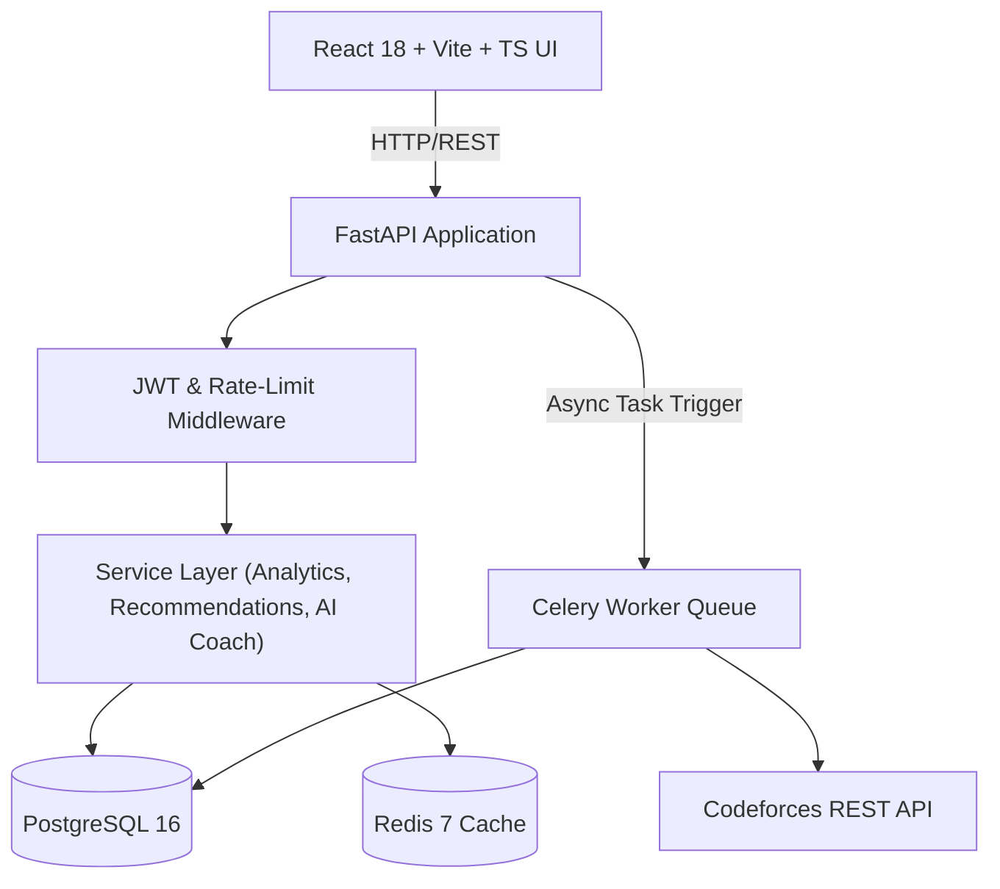

# CF Stalker — System Architecture Specification

## Overview
CF Stalker is designed as a **Modular Monolith** using FastAPI for high-concurrency API performance, PostgreSQL for normalized relational data storage, Redis for multi-tier caching and task broker management, and Celery for asynchronous background job execution.

## Architectural Design Principles
1. **Separation of Concerns**: Clean isolation between API layer (FastAPI routes), domain validation (Pydantic schemas), database layer (SQLAlchemy ORM), business logic (Services), and background workers (Celery).
2. **Asynchronous Non-Blocking API**: Fast HTTP responses by delegating long-running data syncs to background workers.
3. **Resilient Third-Party Integration**: Codeforces API calls are strictly rate-limited using a Redis Token-Bucket algorithm (max 1 request per 2 seconds).
4. **Contextual LLM AI Coach**: Rather than generic chat, the AI coach receives a computed statistical metric payload and responds in structured JSON.
